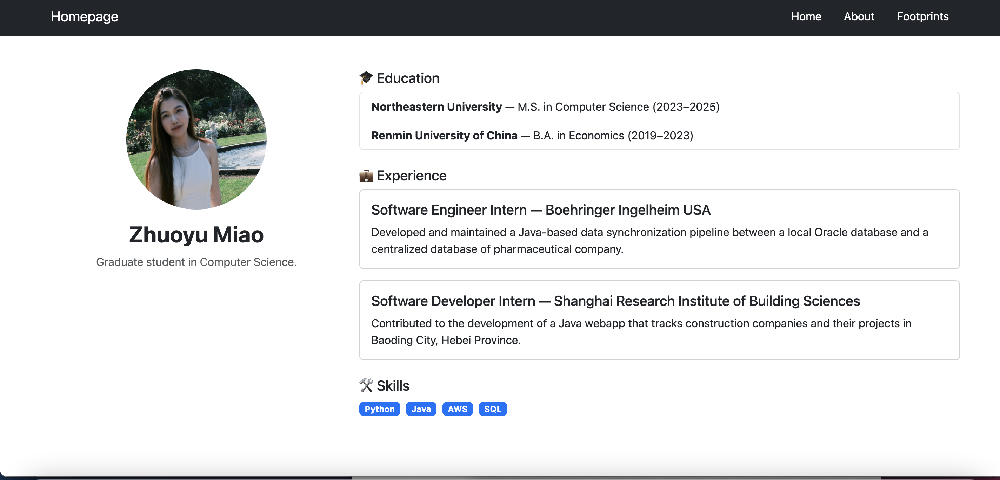

# 🚀 Homepage Project

## 🎯 Project Objective
This project is a personal homepage that showcases my portfolio and hobbies.  
The objective is to provide a simple, responsive, and accessible website to introduce myself.

---

## 📸 Demo




---

## ⚙️ Tech Requirements
- HTML5, CSS3, JavaScript
- Node.js >= 20
- ESLint + Prettier for code linting and formatting
- Git + GitHub for version control and hosting

---

## 📥 Installation & Usage
```bash
# Clone the repo
git clone https://github.com/zhuoyumiao/homepage.git
cd homepage

# If dependencies exist (optional)
npm install

# Open index.html directly in the browser
# or use a simple local server
```

---

## 👩‍💻 Author & Link
Author: Zhuoyu Miao

Link: https://zhuoyumiao.github.io/homepage/

---

## 📚 Reference to the Class
This project was created as part of the **CS5610 Web Development** course at Northeastern University.

---

## 🎥 Video Demo
Link of video demonstration: 

Demonstration slide: https://docs.google.com/presentation/d/1BSxjAtiIHsOu3krMY7_weiDlXbmVeh_rmLzXQTdzRfM/edit?usp=sharing

---

## 🤖 AI usage
Used chatGPT to help me generate the css file of my footprints page. Used the GPT-5 and prompt “make an css file that generates a world map which we can click and shows pictures”.
Used chatGPT to help me generate the README.md file. Used GPT-5 and prompt “write a readme with Good project name Project objective Screenshot (gifs are preferred) Tech requirements How to install/use Author with link to homepage Reference to the class with link Link to the video demonstration”
